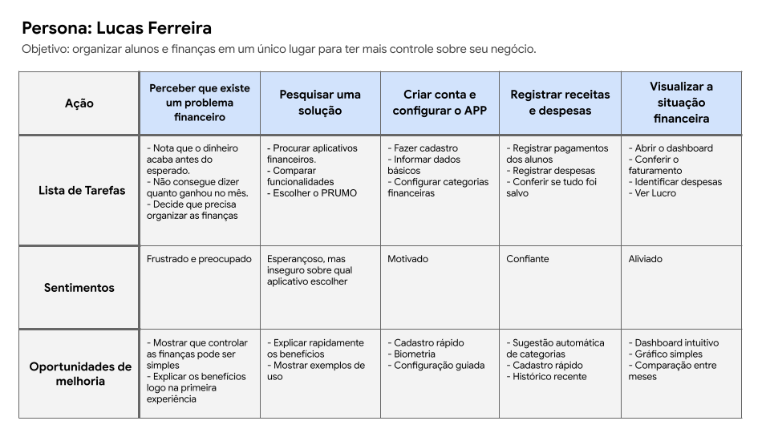

# Pesquisa UX

A etapa de pesquisa foi fundamental para compreender as necessidades, dificuldades e objetivos dos personal trainers autônomos em relação à gestão do seu negócio.

Durante essa fase, foram investigados os principais desafios enfrentados por esses profissionais no gerenciamento de alunos, pagamentos e indicadores financeiros, permitindo identificar oportunidades para o desenvolvimento de uma solução mais eficiente e centrada no usuário.

---

## Objetivos da pesquisa

- Compreender como personal trainers administram alunos e finanças;
- Identificar as principais dificuldades relacionadas ao controle financeiro do negócio;
- Entender quais informações são mais relevantes para apoiar a tomada de decisões profissionais;
- Investigar oportunidades para centralizar processos atualmente distribuídos entre diferentes ferramentas.

---

## Persona

A persona foi criada a partir dos principais comportamentos e necessidades identificados durante a pesquisa. Ela representa o perfil do usuário para o qual o PRUMO está sendo desenvolvido e auxilia na tomada de decisões ao longo do processo de design.

    

---

## Jornada do Usuário

O mapa da jornada do usuário permitiu visualizar as ações, pensamentos e emoções do personal trainer durante o processo de gerenciamento financeiro do seu negócio, evidenciando oportunidades de melhoria na experiência proposta pelo produto.

    

---

## Principais insights

A pesquisa revelou alguns desafios recorrentes entre os participantes:

- Controle manual de pagamentos;
- Utilização de múltiplas ferramentas para administrar o negócio;
- Dificuldade para acompanhar receitas, despesas e lucros;
- Falta de indicadores financeiros para apoiar decisões profissionais.

---

## Próximos passos

Os resultados desta etapa serão utilizados como base para a auditoria competitiva e para o desenvolvimento dos wireframes e protótipos iniciais do PRUMO.
